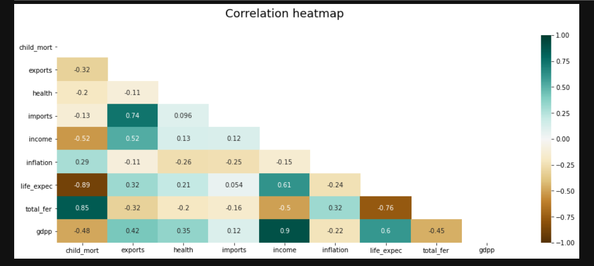
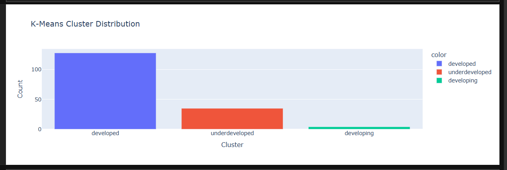
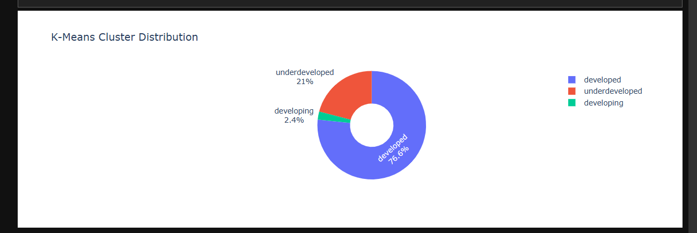

# Country Development Classification Project


---------------------------------------------------

---------------------------------------------------

---------------------------------------------------


## Project Overview
This project focuses on classifying countries based on socio-economic and health factors into three categories: **underdeveloped**, **developing**, and **developed** countries. Using the **Country-data** dataset, we apply dimensionality reduction and clustering techniques to uncover patterns and group similar countries together.

## Dataset Description
The dataset contains **167 rows** and **10 columns**. Below is a detailed description of each column:

| Column Name    | Description |
|----------------|-------------|
| `country`      | Name of the country |
| `child_mort`   | Death of children under 5 years of age per 1000 live births |
| `exports`      | Exports of goods and services per capita, given as a percentage of GDP per capita |
| `health`       | Total health spending per capita, given as a percentage of GDP per capita |
| `imports`      | Imports of goods and services per capita, given as a percentage of GDP per capita |
| `Income`       | Net income per person |
| `Inflation`    | The measurement of the annual growth rate of the Total GDP |
| `life_expec`   | The average number of years a newborn child would live if the current mortality patterns remain the same |
| `total_fer`    | The number of children that would be born to each woman if current age-fertility rates remain the same |
| `gdpp`         | GDP per capita, calculated as Total GDP divided by total population |

**Disclaimer:** Country development is defined based on the socio-economic and health factors.

## Objective
The main goal of this project is to **categorize countries** into three development levels using the available socio-economic and health indicators.

## Methodology
The following steps are performed in this project:

1. **Data Preprocessing**
   - Handling missing values
   - Standardizing numerical features to ensure all variables are on a comparable scale

2. **Dimensionality Reduction**
   - **Principal Component Analysis (PCA)** is used to reduce the dimensionality of the dataset and visualize clusters effectively.

3. **Clustering Techniques**
   - **K-Means Clustering**: Groups countries into clusters based on similarity in socio-economic and health indicators.
   - **Hierarchical Clustering**: Uses a tree-based approach to categorize countries and visualize relationships via dendrograms.

4. **Cluster Analysis**
   - Analysis of clusters to identify patterns and categorize countries into **underdeveloped**, **developing**, and **developed** categories.
   - Visualizations for cluster distribution and principal components.

## Tools and Libraries
The project is implemented in **Python** using the following libraries:

- `pandas` – Data manipulation and analysis  
- `numpy` – Numerical computations  
- `matplotlib` & `seaborn` – Data visualization  
- `scikit-learn` – PCA and K-Means clustering  
- `scipy` – Hierarchical clustering  

## Results
The outcome of this project includes:

- Categorized list of countries by development status  
- PCA visualizations showing how countries cluster in reduced dimensions  
- Dendrograms and K-Means cluster plots  
- Insights on socio-economic and health factors that define country development  

## Conclusion
This project demonstrates how unsupervised learning techniques can help classify countries based on socio-economic and health factors. By using PCA and clustering methods, we can gain insights into global development patterns and identify countries that are underdeveloped, developing, or developed.

## How to Run
1. Clone the repository.
2. Install required libraries:  
   ```bash
   pip install pandas numpy matplotlib seaborn scikit-learn scipy
